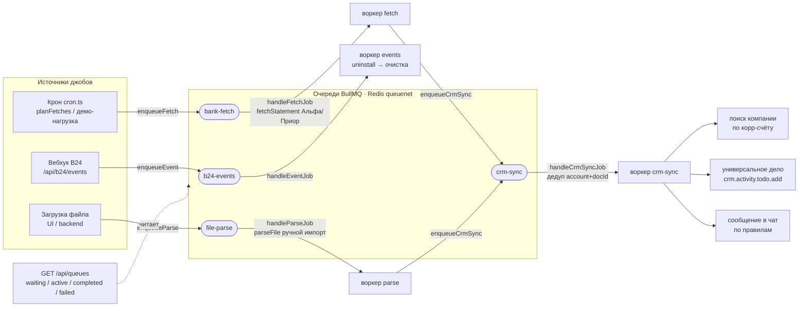

# Очереди обработки (BullMQ + Redis)

> Last reviewed: 2026-07-01

Справка по шине очередей backend'а: какие очереди, что несут, как соединены и где брать
метрики для визуализации. Код — `server/queue/*`; решение и статус в дорожной карте —
[`REFACTOR_PLAN.md`](REFACTOR_PLAN.md) (стадия 3, «Фоновая обработка»).

## Зачем очереди

Фоновая обработка вынесена в **BullMQ поверх Redis** (не Nitro tasks) — под нагрузку и
масштабирование: приём событий портала, опрос банков, разбор загруженных файлов и запись
в Bitrix24 идут асинхронно, переживают ретраи и масштабируются воркерами. Redis — на
изолированной сети `queuenet` (`internal: true`, том `redisdata`), наружу не смотрит.

## Четыре очереди

Контракты (имена, payload'ы, идемпотентные `jobId`) — чистые, без зависимости от Redis:
[`server/queue/topology.ts`](../server/queue/topology.ts) (покрыто тестами).

| Очередь | Константа | Payload | Кто кладёт | Обработчик делает |
|---|---|---|---|---|
| `b24-events` | `Q_EVENTS` | `EventJob` (`memberId`, `domain`, `kind`, `ts`) | вебхук `POST /api/b24/events` | follow-up после проверенного события; на `ONAPPUNINSTALL` — очистка портала |
| `bank-fetch` | `Q_FETCH` | `FetchJob` (`memberId`, `providerId`, `account`, `dateFrom/To`) | крон (`planFetches`) / демо-нагрузка | тянет окно выписки у банка (Альфа/Приор) → нормализует → кладёт батч в `crm-sync` |
| `file-parse` | `Q_PARSE` | `ParseJob` (`memberId`, `providerId`, `fileRef`, `fileHash`) | загрузка файла (UI/backend — **продюсера ещё нет**, ждёт UI ручной загрузки, #19/#21) | разбирает файл ручной загрузки → нормализует → кладёт батч в `crm-sync` |
| `crm-sync` | `Q_CRM` | `CrmSyncJob` (`memberId`, `providerId`, `source`, `batchId`, `items`) | обработчики `bank-fetch` / `file-parse` (только если операций > 0) | дедуп в батче → на операцию: поиск компании → универсальное дело → чат |

`bank-fetch` и `file-parse` — два входа с разных источников (онлайн-банк и файл), оба дают
нормализованный `StatementItem[]` и **сходятся в `crm-sync`** — общий «анализ + запись в CRM».

## Поток



## Как это работает

- **Идемпотентность.** У каждого джоба **детерминированный `jobId`** (`eventJobId`/`fetchJobId`/
  `parseJobId`/`crmSyncJobId`) — BullMQ давит естественные ретраи: то же окно выписки / тот же
  файл (`fileHash`) / тот же батч (`batchId`) не создаёт дубликат джоба.
- **At-least-once.** Доставка «хотя бы раз», поэтому `crm-sync` дедупит **внутри батча** по
  `account|docId`. Но это **не** защищает от повторной доставки *всего* джоба (падение воркера
  после частичной записи) — нужен **персистентный стор** `{account|docId → activityId}`,
  сверяемый read-before-write. Это **блокер стадии 4** — [issue #9](https://github.com/bx-shef/client-bank-alfa-by/issues/9); пока он не
  готов, `writeActivity` остаётся заглушкой.
- **Чистые обработчики с DI.** [`handlers.ts`](../server/queue/handlers.ts) — вся логика
  (`handleFetchJob`/`handleParseJob`/`handleCrmSyncJob`/`handleEventJob`) принимает `HandlerDeps`
  (сайд-эффекты инъектируются), поэтому оркестрация покрыта тестами с фейками. Реальные
  транспорты (fetch банка, парсер файла, B24 REST) подключаются в [`worker.ts`](../server/queue/worker.ts)
  (`liveHandlerDeps`) и наполняются на стадиях 3–6 — сейчас это заглушки.
- **Демо-нагрузка.** Пока реальных счетов нет, конвейер гоняет синтетику: крон каждые
  `CRON_INTERVAL_MIN` кладёт `DEMO_LOAD_N` fetch-джобов (`buildDemoFetchJobs`), их обработчик
  отдаёт `demoItems` (пара операций) — видно, как нагрузка течёт `bank-fetch → crm-sync`.
- **Воркеры** — пока **in-process** (плагин [`server/plugins/queue.ts`](../server/plugins/queue.ts)
  поднимает их на старте backend). Масштаб-аут в отдельный воркер-контейнер (реплики) — следующий шаг.
- **Ленивое подключение.** [`connection.ts`](../server/queue/connection.ts): `getQueue(name)`
  создаёт очередь по первому обращению; гуард `queueEnabled()` — без `REDIS_URL` продюсеры
  ([`producers.ts`](../server/queue/producers.ts)) работают no-op (приложение не падает без Redis).

## Наблюдаемость (источник для визуализации)

- **`GET /api/queues`** ([`server/api/queues.get.ts`](../server/api/queues.get.ts)) — по каждой из
  четырёх очередей счётчики `getJobCounts()`:
  `{ waiting, active, completed, failed, delayed, paused }`.
  Это и есть данные для графика: опрашивать раз в несколько секунд, рисовать по времени.
  Guard — `B24_APPLICATION_TOKEN` (заголовок `X-Check-Token` или `?token=`, constant-time);
  снаружи закрыт (nginx `deny all`).
- **`scripts/queue-stats.sh`** — тот же срез из консоли.
- Глубокая телеметрия (Prometheus-экспортёр BullMQ / bull-board / Grafana) — зафиксированное
  намерение, отдельный этап.

Пример ответа:

```jsonc
{
  "enabled": true,
  "queues": {
    "b24-events": { "waiting": 0, "active": 0, "completed": 3, "failed": 0, "delayed": 0, "paused": 0 },
    "bank-fetch": { "waiting": 2, "active": 1, "completed": 40, "failed": 0, "delayed": 0, "paused": 0 },
    "file-parse": { "waiting": 0, "active": 0, "completed": 0, "failed": 0, "delayed": 0, "paused": 0 },
    "crm-sync":   { "waiting": 5, "active": 1, "completed": 38, "failed": 1, "delayed": 0, "paused": 0 }
  }
}
```

## Визуализация (живой график)

Страница-монитор **`/queues`** ([`app/pages/queues.vue`](../app/pages/queues.vue)) рисует
живой график длины очередей (backlog = ждут + в работе) на **Apache ECharts** (лицензия
Apache-2.0, бесплатна — без вотермарок и лицензионных ограничений). Компонент —
[`app/components/QueueMonitor.vue`](../app/components/QueueMonitor.vue); чистая логика
временного ряда (скользящее окно, дедуп точек, легенда) — [`app/utils/queueChart.ts`](../app/utils/queueChart.ts)
(покрыта тестами). ECharts грузится динамически только на этой странице (вне лендинг-бандла).

- **X** — время, **Y** — backlog очереди; каждая очередь = линия (у `crm-sync` — заливка);
  на конце линии — текущее значение; справа — таблица `ждут / работа / готово / ошибки`
  (клик по строке скрывает/показывает линию); кнопка пауза + выбор интервала опроса.
- Ряд строится **на клиенте**: `GET /api/queues` отдаёт только текущий снапшот (без истории),
  поэтому каждый опрос добавляет точку и сдвигает окно (эффект бегущей ленты).
- Сейчас страница на **демо-данных** (генератор в `queues.vue`) — `/api/queues` server-only
  (guard + nginx `deny all`), из браузера портала недостижим; в операторской среде заменить
  `demoFetcher` на реальный `fetch('/api/queues')` с токеном. Глубокая телеметрия (Grafana) — далее.

Порт выполнен по внешнему примеру `shef.rabbitmq:statistic` (оригинал — коммерческий amCharts4),
переведён на бесплатную ECharts.

## Переменные окружения

| Переменная | Назначение |
|---|---|
| `REDIS_URL` | Подключение к Redis; без неё очереди выключены (`queueEnabled()` = false, продюсеры no-op) |
| `CRON_INTERVAL_MIN` | Период тика крона (мин); частота опроса банков регулируется приложением — [issue #54](https://github.com/bx-shef/client-bank-alfa-by/issues/54) |
| `DEMO_LOAD_N` | Сколько синтетических fetch-джобов класть за тик (демо-поток); `0` = выключено |
| `B24_APPLICATION_TOKEN` | Guard эндпоинта `GET /api/queues` (и служебных проверок) |

## Смежное

- [issue #54](https://github.com/bx-shef/client-bank-alfa-by/issues/54) — частота опроса банков (редкая, управляется приложением) + кнопка «Опросить сейчас».
- [issue #9](https://github.com/bx-shef/client-bank-alfa-by/issues/9) — персистентный стор дедупа (блокер реальной записи в `crm-sync`).
- [`REFACTOR_PLAN.md`](REFACTOR_PLAN.md) — стадии 4–6 наполняют транспорты обработчиков реальной логикой.
