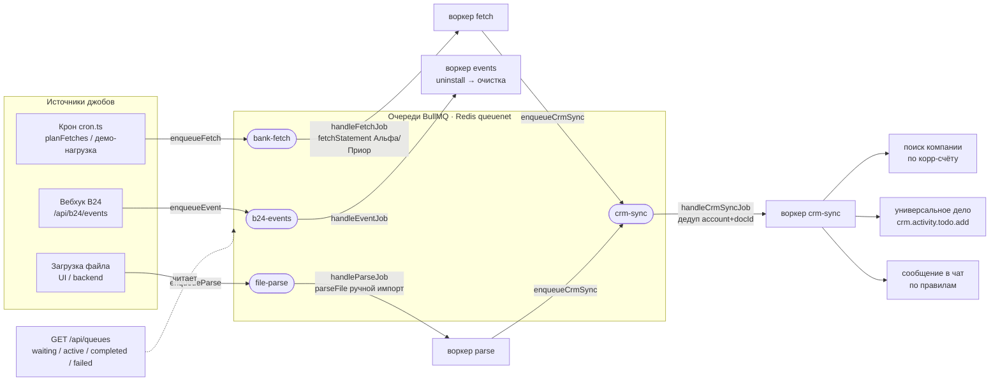

# Очереди обработки (BullMQ + Redis)

> Last reviewed: 2026-08-24

Справка по шине очередей backend'а: какие очереди, что несут, как соединены и где брать
метрики для визуализации. Код — `server/queue/*`; решение и статус в дорожной карте —
[`REFACTOR_PLAN.md`](REFACTOR_PLAN.md) (стадия 3, «Фоновая обработка»).

## Зачем очереди

Фоновая обработка вынесена в **BullMQ поверх Redis** (не Nitro tasks) — под нагрузку и
масштабирование: приём событий портала, опрос банков, разбор загруженных файлов и запись
в Bitrix24 идут асинхронно, переживают ретраи и масштабируются воркерами. Redis — на
изолированной сети `queuenet` (`internal: true`, том `redisdata`), наружу не смотрит.

## Очереди

Контракты (имена, payload'ы, идемпотентные `jobId`) — чистые, без зависимости от Redis:
[`server/queue/topology.ts`](../server/queue/topology.ts) (покрыто тестами).

| Очередь | Константа | Payload | Кто кладёт | Обработчик делает |
|---|---|---|---|---|
| `b24-events` | `Q_EVENTS` | `EventJob` (`memberId`, `domain`, `kind`, `ts`) | вебхук `POST /api/b24/events` | follow-up после проверенного события; на `ONAPPUNINSTALL` — очистка портала |
| `bank-fetch` | `Q_FETCH` | `FetchJob` (`memberId`, `providerId`, `account`, `dateFrom/To`) | крон (`planFetches`) / демо-нагрузка | тянет окно выписки у банка (Альфа/Приор) → нормализует → кладёт батч в `crm-sync` |
| `bank-fetch-prior` | `Q_FETCH_PRIOR` | `FetchJob` (тот же) | крон (`fetchQueueFor`, provider=`prior-by`) | то же для Приора, но **своя** очередь: бюджет в ЗАПРОСАХ (задача ≈ 11 HTTP: resolve + create + опросы + обход страниц) и свои слоты (`QUEUE_PRIOR_CONCURRENCY`), поэтому длинный create+poll не блокирует Альфу и не тратит её лимит |
| `file-parse` | `Q_PARSE` | `ParseJob` (`memberId`, `providerId`, `fileName`, `contentBase64`, `fileHash`, `userId?`) | эндпоинт `POST /api/import` (ручная загрузка) | декодирует (windows-1251) и разбирает файл → нормализует → кладёт батч в `crm-sync` |
| `crm-sync` | `Q_CRM` | `CrmSyncJob` (`memberId`, `providerId`, `source`, `batchId`, `items`) | обработчики `bank-fetch` / `file-parse` (только если операций > 0) | дедуп в батче → на операцию: поиск компании → универсальное дело → чат |
| `b24-deletions` | `Q_DELETIONS` | `DeletionJob` (`memberId`, `domain`, `eventCode`, `entityId`, `entityTypeId?`, `ts`) | вебхук CRM-удаления (§9.2) | классифицирует по SP-конфигу → reconcile леджера / чат ошибок (primary-инстанс, concurrency 1) |
| `feedback-post` | `Q_FEEDBACK` | `FeedbackPostJob` (`memberId`, `kind`, `payload`, `contentHash`) | роут `POST /api/feedback` при **транзиентном** сбое GitHub (#61) | ретраит POST issue с backoff (`FEEDBACK_RETRY_OPTS`) → на успехе #195-метрика; перманентный 4xx — дроп |
| `trigger-fire` | `Q_TRIGGER` | `TriggerFireJob` (`memberId`, `triggerCode`, `targetKind`, `targetId`, `targetEntityTypeId?`, `opKey`) | crm-sync при **промахе** синхронного фаера триггера (#79) | пере-фаерит `crm.automation.trigger.execute` с backoff (`TRIGGER_RETRY_OPTS`) до `{result:true}` (само-заживает, когда CODE зарегистрирован); `unsupported`/битый CODE — дроп |
| `registry-write` | `Q_REGISTRY` | `RegistryWriteJob` (`memberId`, `providerId`, `item`, `companyId`, `paymentSp`) | crm-sync при отказе синхронной записи элемента реестра (#578) | пере-записывает элемент СП «Платежи» с backoff; запись идемпотентна по маркеру операции **и дописывает колонки уже существующему элементу** — иначе повтор «успешно» не делал бы ничего |
| `activity-bind` | `Q_BINDINGS` | `ActivityBindJob` (`memberId`, `activityId`, `refs`) | crm-sync, когда часть привязок дела не встала (#585) | доставляет привязки: читает `crm.activity.binding.list` и ставит **только недостающие** (повторная привязка той же пары — ошибка портала) |

`bank-fetch` и `file-parse` — два входа с разных источников (онлайн-банк и файл), оба дают
нормализованный `StatementItem[]` и **сходятся в `crm-sync`** — общий «анализ + запись в CRM».

⚠ **Три последние очереди — не части конвейера, а САМОЛЕЧЕНИЕ** (`trigger-fire`, `registry-write`,
`activity-bind`). Общая у них причина: соответствующая запись идёт ПОСЛЕ маркера дедупа, поэтому
повтор `crm-sync` до неё уже не дойдёт — операция отсеется на гейте. Без очереди проглоченный отказ
терял результат навсегда, и знал об этом только счётчик в строке итога.

⚠ Очереди дозаписи РАЗНЫЕ, хотя болезнь одна: payload реестра несёт операцию выписки (финансовые
ПДн ⇒ подметается `statementSweep`), payload привязок — только id сущностей CRM. Общая очередь
заставила бы потребителя разбирать вид задачи, а бюджет простоя стал бы средним по больнице.

## Поток


```mermaid
flowchart LR
  subgraph SRC[Источники джобов]
    WH[Вебхук B24<br/>/api/b24/events]
    CRON[Крон cron.ts<br/>planFetches / демо-нагрузка]
    UP[Загрузка файла<br/>UI / backend]
  end

  subgraph Q[Очереди BullMQ  ·  Redis queuenet]
    QE([b24-events])
    QF([bank-fetch])
    QP([file-parse])
    QC([crm-sync])
  end

  WH -- enqueueEvent --> QE
  CRON -- enqueueFetch --> QF
  UP -- enqueueParse --> QP

  QE -->|handleEventJob| WE[воркер events<br/>uninstall → очистка]
  QF -->|handleFetchJob<br/>fetchStatement Альфа/Приор| WF[воркер fetch]
  QP -->|handleParseJob<br/>parseFile ручной импорт| WP[воркер parse]

  WF -- enqueueCrmSync --> QC
  WP -- enqueueCrmSync --> QC

  QC -->|handleCrmSyncJob<br/>дедуп account+docId| WC[воркер crm-sync]
  WC --> FC[поиск компании<br/>по корр-счёту]
  WC --> WA[универсальное дело<br/>crm.activity.todo.add]
  WC --> NC[сообщение в чат<br/>по правилам]

  OBS[GET /api/queues<br/>waiting / active / completed / failed] -. читает .-> Q
```

## Как это работает

- **Идемпотентность.** У каждого джоба **детерминированный `jobId`** (`eventJobId`/`fetchJobId`/
  `parseJobId`/`crmSyncJobId`) — BullMQ давит естественные ретраи: то же окно выписки / тот же
  файл (`fileHash`) / тот же батч (`batchId`) не создаёт дубликат джоба. ⚠ Дедуп по id действует
  и против **FAILED-трупа** (BullMQ не различает) — поэтому `enqueueParse`/`enqueueCrmSync` перед
  `add` явно **снимают** failed-джобу с тем же id (#430 C3): повторная загрузка того же файла после
  исчерпанных попыток (например, после починки токена) перезапускается сразу, а не через сутки
  age-эвикции.
- ⚠ **Дедуп ЗАВЕРШЁННОЙ джобы зависит от того, кто просит (#498).** Он верен для машины и вреден
  для человека, и это не оттенок, а два разных случая:
  - `enqueueParse` и `enqueueCrmSync` при **`source:'parse'`** (то есть человек нажал «Записать в
    CRM») освобождают id и у **COMPLETED** джобы — `unstickFinished`. Повторная загрузка того же
    файла это не дубль, а **починка**: оператор увидел «117 обработано, 0 создано», настроил портал
    и загрузил заново. Раньше это молча не делало ничего, а экран показывал прошлое «всё разобрано».
    Разблокировать при этом надо ОБЕ очереди: свежий разбор ставит `crm-sync` с тем же ключом (хеш
    файла), и правка одной только `file-parse` просто передвинула бы тупик на шаг ниже.
  - `enqueueCrmSync` при **`source:'fetch'`** (крон) — `unstickFailedOnly`, как было. Его `batchId`
    это хеш СОДЕРЖИМОГО: тот же id означает буквально те же операции, и повторный прогон перечитывал
    бы маркеры в Б24 по каждой из них ради вывода «уже записано». Этот дедуп держит нагрузку.
  - `waiting`/`active`/`delayed` дедуплицируются ВСЕГДА и на обоих путях: джоба в работе — это
    единственный случай, когда вторая копия действительно дубль (двойной клик, повторная доставка).
  - `bank-fetch` не unstick-ается вовсе — у него прежняя age-механика (см. ниже).
- ⚠ **Цена повторного прогона.** То, что раньше было бесплатным no-op, теперь полноценный проход:
  `crm-sync` ищет маркер в Б24 по КАЖДОЙ операции, даже когда исход — «пропустить». На выписке в
  сотни строк это сотни REST-вызовов на клик. Порталы друг от друга изолирует пер-портальный
  лимитер SDK (2 req/s), поэтому уронить соседа нельзя, но воркер-пул общий: большой повторный
  прогон одного портала может задержать чужие джобы (тот же head-of-line, что у демо-нагрузки ниже).
  Пер-портального кулдауна на `/api/import` сознательно НЕТ: он ключевался бы по порталу и отвечал бы
  «подождите» человеку, загрузившему ДРУГОЙ файл, — то есть ломал бы ровно тот путь починки, ради
  которого дедуп и снят. Ограничение снаружи — nginx `limit_req` зоны `import`.
- **At-least-once.** Доставка «хотя бы раз», поэтому `crm-sync` дедупит **внутри батча** по
  `dedupKey` (`account|docId`; пустой `docId` → контент-сигнатура, #430 C1 —
  [`PROCESSING.md`](PROCESSING.md) §1). Против повторной доставки *всего* джоба (падение воркера после частичной записи)
  идемпотентность живёт **в B24, не в нашей БД** (#259, [`PROCESSING.md`](PROCESSING.md) §1): `writeActivity`
  пишет **универсальное дело** (`crm.activity.todo.add`) и следом ставит маркер `ORIGINATOR_ID`+`ORIGIN_ID`, а
  `handleCrmSyncJob` **перед записью** ищет этот маркер (`getActivityId`→`findActivityByMarker`→
  `crm.activity.list`) и пропускает уже записанные — стора `activity_dedup` больше нет, `rememberActivity`
  убран. Транспорт **живой** (`writeTodoActivityViaRest`) по per-portal
  `RestCall`, с гейтом демо-счётов (`isDemoAccount`) — демо-нагрузка в реальный портал не пишет.
  ⚠ **Маркер ставится ВТОРЫМ вызовом** (`crm.activity.update`) — `todo.add` его не принимает (#495).
  Между вызовами дело существует без маркера: упавший update компенсируется удалением сироты, но
  жёсткий крах между ними оставит дубль. Это принятая цена работающей карточки компании; проверяется
  live-смоуком `pnpm activity:test` (write + дедуп round-trip). Инвойс/смарт-процесс несут `xmlId` — для будущего носителя-элемента СП (§2/§5).
  Чужие поля (`originId`/`xmlId` клиентских сделок/инвойсов) **не штампуем** — наш маркер на нашей записи.
- **Брак пакета без ключа портала.** Воркер, взяв пакет, **первым делом** проверяет наличие токена
  портала. Нет (приложение удалено, в т.ч. посреди выгрузки) → пакет **отвергается** (убрать из очереди,
  не повторять) + лог «пакет из B24 `<домен>` не нашёл свой ключ». Это **не** ретраибл-ошибка — ключ
  пропал насовсем. Отличать от временной (сеть/лимит → повтор). Та же проверка — на приёме файла
  (`PROCESSING.md` §0). ⬜ сейчас отсутствие токена срабатывает молча (операция → «не привязано»), без
  явного брака и лога — доделать вместе с реальным `parseFile`.
- **Чистые обработчики с DI.** [`handlers.ts`](../server/queue/handlers.ts) — вся логика
  (`handleFetchJob`/`handleParseJob`/`handleCrmSyncJob`/`handleEventJob`) принимает `HandlerDeps`
  (сайд-эффекты инъектируются), поэтому оркестрация покрыта тестами с фейками. Реальные
  транспорты (fetch банка, парсер файла, B24 REST) подключаются в [`worker.ts`](../server/queue/worker.ts)
  (`liveHandlerDeps`) — **живые**: парсер файла (ручной импорт), B24 REST (crm-sync) и **fetch банка
  Альфы (A9, `fetchBankStatement`)**; реальный счёт без банк-токена → `[]` инертно; Приор — в автоопросе (`prior-by` в `POLLABLE_PROVIDERS`, своя очередь `bank-fetch-prior`). **Глобальный
  rate-limiter (A8)** на `Q_FETCH` (BullMQ `limiter`, шаренный по репликам через Redis,
  `QUEUE_FETCH_RATE_*`) держит суммарный темп Альфы под её per-client cap. ⚠ Бюджет задаётся **в
  запросах** (дефолт 80/60с — 80 % от документированного банком потолка), а лимитер считает
  **задачи**, поэтому `providerJobRate` делит бюджет на стоимость задачи: с #561 задача Альфы это
  выписка + проход по странице, то есть **40 задач**/60с. Читать это число как «80 задач» —
  ровно тот перерасход, ради запрета которого деление и заведено (подробности ниже, §Стоимость). Упор в кап BullMQ **не теряет**
  джобы — откладывает (лежат в `waiting`/`delayed`), что на графике неотличимо от бэклога; поэтому крон после
  каждого опроса **явно логирует сатурацию**, когда backlog переходит `QUEUE_FETCH_SATURATION_THRESHOLD`
  (дефолт 200, `server/queue/saturation.ts`) — см. `docs/OPERATIONS.md`.
- **Демо-нагрузка.** Пока реальных счетов нет, конвейер гоняет синтетику: демо-крон каждые
  `DEMO_TICK_SEC` **секунд** кладёт `DEMO_LOAD_N` fetch-джобов (`buildDemoFetchJobs`), их обработчик
  отдаёт `demoItems` (пара операций) — видно, как нагрузка течёт `bank-fetch → crm-sync`. Чтобы очереди
  **были видны** на графике (а не разгребались в 0 мгновенно), демо-джобы держат искусственную паузу
  `DEMO_DELAY_MS` (только для демо-счётов — `fetchStatement`/`findCompany` в `worker.ts`; реальные джобы
  не тормозятся). `DEMO_DELAY_MS=0` → мгновенный разгреб (линия ложится в 0). Настоящий опрос (A10) — на
  `CRON_INTERVAL_MIN` (минуты): крон-инстанс кладёт fetch-джоб на каждый подключённый счёт
  (`listAllBankAccounts`→`accountsForPolling`→`planFetches`, окно `[today−CRON_LOOKBACK_DAYS, today]`,
  `epoch`-метка тика → каждый тик = отдельная джоба, epoch прокинут и в `batchId`, иначе crm-sync
  схлопнулся бы). **Default-OFF** (`CRON_REAL_POLL`, opt-in — включать вместе с проверкой боевой нагрузки;
  rate-limiter A8 уже стоит); инертен и потому, что реестр пуст до подключения счетов (A7).
  ⚠ **`accountsForPolling` отсеивает не только «не тот провайдер»**: из плана выпадают подключения БЕЗ
  выбранного счёта (`~pending:`, #407 — у банка нет такого номера) и подключения на ПАУЗЕ
  (`poll_paused`, #576 — выбор администратора клиента). Через эту ОДНУ точку идут оба пути, крон и
  ручное «Опросить сейчас», поэтому пауза действует на оба. ⚠ Продление токенов её НЕ видит
  (`bankTokenKeepAlive` читает свою выборку) — иначе приостановленное подключение умирало бы за ночь.
  ⚠ Окно опроса остаётся `[today−CRON_LOOKBACK_DAYS, today]`, то есть **пропущенное за время паузы не
  наверстывается**: после долгой паузы старые операции не подтянутся, лечится ручной загрузкой файла.
  - **Самоограничение (дефолты безопасны).** Узкое место — `crm-sync`: на fetch-джоб приходится
    `2 × DEMO_DELAY_MS` работы, воркеры concurrency=1. Чтобы очередь не росла бесконечно, держите
    `DEMO_LOAD_N × 2 × DEMO_DELAY_MS ≤ DEMO_TICK_SEC × 1000`. Дефолты (N=3, tick=5с, delay=600мс) ≈72% —
    самоограничены; **`DEMO_LOAD_N ≥ 5`** при 5-сек тике (или `DEMO_TICK_SEC=1`) переполнит `crm-sync`.
    В проде демо выключено (`DEMO_LOAD_N=0`), `removeOnComplete/Fail` (1000/5000) кап completed/failed;
    **очереди с содержимым выписки** (`file-parse`/`crm-sync`) — ограниченное по **возрасту** удержание
    (`STATEMENT_JOB_RETENTION`: complete 1 ч / fail сутки), чтобы финансовые ПДн вытекали из Redis (#245,
    [`PRIVACY.md`](PRIVACY.md)). BullMQ-`age` вытесняет **лениво** (на следующей джобе), поэтому гарантию
    **по стенным часам** даёт периодический sweep на крон-инстансе (`STATEMENT_SWEEP`, `statementSweep.ts`).
    Рядом, но **вне** этого флага, крон чистит итоги ручных загрузок `import_batch` старше 3 дней
    (`sweepOldBatches`, #417): строка несёт имя файла клиента, и ставить чистку ПДн в зависимость от
    тумблера чистки очередей нельзя. `crm-sync` для `source:'parse'` дополнительно пишет итог этой
    загрузки, а `file-parse` помечает её провал — **только на последней попытке**, чтобы не показать
    сотруднику ошибку и через минуту передумать.
  - **Демо делит in-process воркеры с боевыми джобами** (concurrency=1): реальный джоб может подождать
    *за* приостановленным демо-джобом (head-of-line). Сейчас неактуально (боевой опрос инертен до
    подключения счетов A7, в проде демо off); при сосуществовании — отдельная демо-очередь / bump concurrency.
- **Воркеры** поднимает плагин [`server/plugins/queue.ts`](../server/plugins/queue.ts) на старте — но
  **по роли** (`QUEUE_WORKERS`/`QUEUE_CRON`, см. «Масштабирование» ниже): одиночный контейнер тянет всё,
  либо роли разведены (backend = API+крон, сервис `worker` = обработка, масштабируется репликами).
- **Ленивое подключение.** [`connection.ts`](../server/queue/connection.ts): `getQueue(name)`
  создаёт очередь по первому обращению; гуард `queueEnabled()` — без `REDIS_URL` продюсеры
  ([`producers.ts`](../server/queue/producers.ts)) работают no-op (приложение не падает без Redis).

## Ёмкость опроса на масштабе Маркета (почему очередь не растёт бесконечно)

Порядок величин, на который закладываемся: **~10 500 счетов Альфы, ~20 600 Приора, ~10 000 ручных
загрузок**. Ключевой факт: банки лимитируют **на OAuth-клиента (наше приложение)**, а не на портал и
не на счёт — весь флот делит один бюджет. Значит цикл полного обхода считается так:

```
запросов за обход = Σ(счета провайдера × запросов на счёт)     Альфа 1, Приор ~10 (async create+poll)
время обхода      = запросов / лимит
```

При лимите Альфы 100 запросов/мин: **10 500 счетов → 105 минут на обход**. Тик крона (дефолт 5 мин)
тут ни при чём — **реальную свежесть выписки задаёт лимит**, а не таймер.

**Отсюда главное правило: постановка задач опроса ИДЕМПОТЕНТНА.** Крон не передаёт `epoch`, поэтому
`jobId` стабилен на пару (портал, счёт, окно):

- счёт ещё в очереди/в работе → повторная постановка на следующем тике **молча игнорируется**
  (BullMQ дедупит по `jobId`) — очередь физически не может вырасти больше, чем «по одной задаче на
  подключённый счёт»;
- задача завершилась → `removeOnComplete` освобождает id → следующий тик опрашивает счёт снова;
- задача **упала** → id занят, поэтому `removeOnFail` ограничен по возрасту (час), иначе сбойный счёт
  выпал бы из опроса навсегда.

Без этого арифметика убийственная: 31 100 счетов × каждые 5 минут = ~373 000 задач/час на постановку
против ~6 000/час на слив → Redis умирает за часы. С идемпотентной постановкой система деградирует
**плавно**: при перегрузе просто растёт интервал между опросами одного счёта, а не размер очереди.

Крон логирует ёмкость на каждом тике (`server/queue/pollCapacity.ts`, чистое ядро под тестами):
`N accounts ≈ M bank requests ≈ X min per full sweep`, и предупреждает, когда обход длиннее тика —
это сигнал поднять `CRON_LOOKBACK_DAYS`, чтобы медленный обход не пропускал операции, а не «чинить»
очередь. Ручной «Опросить сейчас» **сохраняет** `epoch` (осознанный форс-рефетч оператора, и он
ограничен пер-портальным кулдауном).

### Замер на реальном Redis (`pnpm loadtest:queue`)

Утверждение про ограниченность очереди **измерено**, а не выведено: `scripts/queue-loadtest.mjs`
гоняет тики крона на живом Redis+BullMQ с флотом 10 500 Альфы + 20 600 Приора (банк-креды не нужны —
проверяется механика очереди). Результат на 6 тиках:

| режим | глубина после 1 тика | после 6 тиков | Redis |
|---|---:|---:|---:|
| **было** (метка тика в `jobId`) | 31 100 | **186 600** (×6, +31 100 за тик) | 178 МБ |
| **стало** (стабильный `jobId`) | 31 100 | **31 100** (×1.00, +0 за тик) | 30 МБ |

При тике 5 минут старый режим добавлял бы **~373 тыс. задач/час** (~365 МБ/час, ~8,5 ГБ/сутки) —
Redis умирал бы за часы. Новый режим держит плато.

Отдельно проверено на живом BullMQ, что ротация при этом **не встаёт**: выполненная задача удаляется
и следующий тик снова ставит счёт; пока задача ждёт — повторные тики её не дублируют; **упавшая**
задача действительно блокирует счёт, пока её не подметёт свип (поэтому fetch-очереди и добавлены в
`statementSweep` — иначе «повтор, а не забвение» было бы неправдой).

### Очередь на провайдера + учёт лимита по ЗАПРОСАМ

Задачи Альфы и Приора несопоставимы по стоимости, поэтому они разведены **по разным очередям**:

| очередь | провайдеры | стоимость задачи | лимитер | слоты |
|---|---|---|---|---|
| `bank-fetch` | Альфа, ручной, демо | **2 запроса** (выписка + проход по странице, #561), доли секунды | `QUEUE_FETCH_RATE_*` (дефолт 80 ЗАПРОСОВ/60с → 40 задач) | `QUEUE_CONCURRENCY` |
| `bank-fetch-prior` | Приор | ~11 запросов, до минут | `QUEUE_PRIOR_RATE_*` (бюджет **в запросах**) | `QUEUE_PRIOR_CONCURRENCY` (дефолт 4) |

Две причины именно так:

- **Учёт по запросам.** BullMQ-лимитер считает **задачи**, а банк — **запросы**. Кап, рассчитанный на
  «1 задача ≈ 1 запрос» пропустил бы у Приора примерно **десятикратный** трафик.
  ⚠ С #561 это перестало быть верным и для **Альфы**: её задача стоит **два** запроса — выписка плюс
  проход по странице, доказывающий, что второй нет. Поэтому `fetchRate` теперь тоже делится на
  стоимость (`providerJobRate`), как у Приора. Бюджет банка при этом НЕ изменился: вдвое меньше
  задач по вдвое большей цене — те же 80 запросов в минуту. ⚠ Ошибиться тут ТИХО и не в свою
  пользу: лимитер считает ЗАДАЧИ, и занижённая стоимость означает перерасход лимита банка при
  полностью зелёных приборах.
  Поэтому env задаёт бюджет в **запросах**, а `providerJobRate` делит его на стоимость задачи:
  `100 запросов/мин ÷ ~10 = 10 задач/мин`. Функция чистая, под тестами, и **никогда не даёт 0**
  (застывшая очередь = тихий простой).
- **Честность.** `bank-fetch` идёт с `QUEUE_CONCURRENCY` (дефолт 1); задача Приора держала бы слот
  минутами и блокировала выборки **всех** порталов, включая Альфу. Свои слоты снимают это.

> Имя `bank-fetch` **сохранено намеренно** — переименование осиротило бы задачи, уже лежащие в Redis
> на момент выкатки. Приор просто получил свою очередь рядом.

После этого `prior-by` **включён** в `POLLABLE_PROVIDERS`. Для прода Приору нужен BY-крипто
TLS-шлюз — он **есть и проверен вживую** (свой образ, #477; СКЗИ покупать не нужно, #41 закрыт),
это требование развёртывания, а не кода. ✅ Прежний блокер согласия снят 2026-08-14, песочница
пройдена насквозь из портала (`PRIOR_API.md`, «Закрытый блокер»). Вторая прод-часть,
метод аутентификации `private_key_jwt` (issue #444), **уже реализована** — переключается
`PRIOR_OAUTH_AUTH_METHOD`.

## Масштабирование обработки (как наращивать обработчики)

**Одна роль контейнера решается env** (чистый парсер — `server/queue/runtime.ts`, `queueRuntimeConfig`):
один и тот же образ backend работает в трёх ролях, без разных сборок.

| Роль | `QUEUE_WORKERS` | `QUEUE_CRON` | `RUN_MIGRATION` | Что делает |
|------|:---:|:---:|:---:|------------|
| Один контейнер (**дефолт**) | 1 | 1 | 1 | и API, и очереди, и крон, и событийный воркер — как раньше |
| HTTP/primary | **0** | 1 | 1 | `/api/*` + крон + **единственный** `b24-events`-воркер; fetch/parse/crm-sync **не** обрабатывает |
| **worker** (масштабируем) | 1 | **0** | **0** | тянет fetch/parse/crm-sync; крон/миграцию/события не трогает |

В `docker-compose.prod.yml` роли разведены: `backend` = HTTP+крон+события (`QUEUE_WORKERS=0`), сервис
**`worker`** = обработка (`QUEUE_CRON=0`, `RUN_MIGRATION=0`). Три инварианта:
- **Крон — ровно на одном** инстансе (backend; иначе N планировщиков наплодят дублей fetch-джобов —
  backend с `container_name` нельзя scale, так и держим один);
- **событийный воркер (`b24-events`) — тоже ровно на одном** (backend): concurrency=1 держит порядок
  install/uninstall только **внутри процесса**, поэтому его нельзя гонять на N реплик `worker`;
- **миграцию** гоняет только backend (иначе реплики воркеров racy на `CREATE TABLE`).

> ⚠ **`QUEUE_WORKERS=0` требует живого `worker`.** Если backend с `QUEUE_WORKERS=0`, а воркер не поднят —
> вебхуки/импорты **встанут молча** (Redis жив ⇒ enqueue успешен ⇒ синхронный фолбэк не срабатывает).
> Поднимать **весь** compose (`docker compose up -d`), не править руками только env backend; после деплоя
> проверить сток очередей (`/queues` / `make queue-stats`). Плагин на старте пишет WARN в лог.

Пропускную способность наращиваем **тремя рычагами**, от простого к сложному:

1. **Concurrency воркера** — `QUEUE_CONCURRENCY=N`: один воркер держит `N` джобов в параллель (дефолт `1`;
   применяется к **fetch/parse**, события — всегда 1). Самый дешёвый рычаг. ⚠ Узкое место — `crm-sync`
   (I/O к B24): включать concurrency/реплики для него **только после** (а) per-portal лимитера/батча
   (`callBatch`, иначе `QUERY_LIMIT`) и (б) **атомарности дедупа** (маркер в B24, #109/#259/PROCESSING §1):
   read-before-write (`findActivityByMarker`→`todo.add`) под параллелизмом — TOCTOU-окно между
   поиском маркера и записью, два воркера могут создать дубль дела. Поэтому **crm-sync ЗАКРЕПЛЁН на
   concurrency 1** (#163, `concurrency: 1` в его `Worker`, не разделяемый `QUEUE_CONCURRENCY`) — поднятие
   общего knob'а масштабирует только fetch/parse и **не** делает crm-sync in-process-параллельным (иначе
   вернулся бы тот самый TOCTOU); **fetch/parse масштабируются свободно**.
   **Страховка от stalled-редоставки (#163, порт из `ai-price-import`).** Даже при concurrency=1 дубль
   мог родиться иначе: BullMQ считает джоб «протухшим» (stalled), если лок воркера не продлился, и отдаёт его
   **второму** воркеру — если первый ещё в `todo.add`, оба минуют маркер и пишут дубль. `crmLockTuning()`
   поднимает `lockDuration`/`stalledInterval` до **60с** (дефолт 30с): живой crm-воркер продлевает лок каждые
   `lockDuration/2` (его await'ы — REST-I/O, не блокируют event loop), поэтому ложно «протухнуть» практически не
   может → второй воркер не стартует параллельно. `maxStalledCount:1` — одна recovery-редоставка реально
   упавшего джоба (read-before-write её делает безопасной: закоммиченная запись оставила маркер). Тюнинг —
   **только на crm-sync** (у него find→write TOCTOU); fetch/parse чисто-идемпотентны, на дефолтах BullMQ.
   Остаточный риск (принят): реальный >60с блок event-loop + незакоммиченная запись на том же тике —
   маловероятен (crm-sync без тяжёлого CPU), самокорректируется на следующем ретрае. Пер-воркерная
   pg-advisory-блокировка отвергнута — держала бы pooled-соединение на REST-записи (`pool max 10` → голодание).
   ⚠ Ровно это и случилось на другом пути: провижининг СП и пересчёт распределения такой лок держали, и
   #538 перевёл их на аренду `single_flight_lease` (соединение занято на один короткий запрос, REST-цепочка
   идёт без него). То есть вывод из этого пункта верен и подтверждён вторым случаем, а не только рассуждением.
2. **Реплики воркер-контейнера** — `docker compose up -d --scale worker=N`. Тот же `startThroughputWorkers()`
   в нескольких контейнерах; все на одном Redis тянут из **одной** очереди — **Redis отдаёт каждый джоб ровно
   одному воркеру**, поэтому добавил реплику → больше throughput, код не меняется. (`deploy.replicas` в
   `docker-compose.prod.yml` — только для Swarm/`--compatibility`; при обычном `up` игнорируется, реальный
   рычаг — `--scale`. С авто-обновлением Watchtower пересоздаёт контейнеры — заданный `--scale` может слететь.)
3. **Очереди масштабируются независимо.** `file-parse` — CPU-bound (декод+парс), `crm-sync` — I/O-bound
   (REST к B24). Даём каждой свой пул воркеров/реплик: `crm-sync` — больше, `file-parse` — меньше.

**Лимиты B24 считаются на ПОРТАЛ**, поэтому:
- **Батчим вызовы** (`callBatch`, до 50 команд в один REST-вызов) — главный рычаг против `QUERY_LIMIT`,
  а не «слать медленнее». На операцию поиск дубля + поиск компаний + запись собираем в один-два батча.
  Лимитер есть и в `@bitrix24/b24jssdk`; на бэкенде сейчас свой `callRest` — подключить батч/троттл оттуда.
- Глобальный лимитер BullMQ (`limiter: { max, duration }`) режет **суммарный** темп, но лимит B24 —
  per-portal, поэтому справедливее **троттлить/группировать по порталу**, чтобы один крупный портал не
  выбирал лимит за счёт остальных. (Это про **B24 REST**. Для **опроса банка** глобальный лимитер, наоборот,
  **верен** — A8: у приложения один Alfa `client_id`, значит один общий кап на весь флот, см. выше §bank-fetch.)
- **Справедливость между порталами** — большая выписка одного портала не должна морозить другие:
  приоритеты джобов / партиционирование по порталу / маленькие пакеты.

### REST-бюджет проводки платежей (#191) — что сделано и что осталось

Проводка `#109` (распознавание→резолюция кандидатов в `crm-sync`) добавила REST-вызовы **на операцию**:
`findCompany` (~2) + `resolveIntents` (до `MAX_RESOLVED_INTENTS_PER_OP=10` lookup'ов) + `writeActivity` (1)
+ `notifyChat` (1, если настроен чат).
`payment-number` резолвится company-wide сканом оплат (`crm.item.list` сделок + `crm.item.payment.list` на
каждую сделку — N+1, без пагинации). Назначение платежа **контролирует плательщик**, поэтому объём вызовов
частично управляем недоверенным вводом.

**Реестр платежей (#575) — самая крупная прибавка с момента написания раздела, и она ограничена
дедупом, а не капом.** Элемент СП пишется теперь на КАЖДУЮ операцию, а не только внутри ветки
`allocate`: `ensurePaymentElement` — это `crm.item.list` (поиск по маркеру) + `crm.item.add`, то есть
**+2 вызова на операцию**, и второй зависит от результата первого, поэтому в батч они не сворачиваются.

⚠ **Но прибавка разовая, а не на каждый опрос.** Дедуп-гейт наверху цикла `crm-sync` ищет маркер
ДЕЛА и пропускает операцию целиком, не доходя до реестра. Значит цена платится один раз за
операцию — при первом её появлении, — а повторный опрос (окно намеренно нахлёстывается,
`CRON_LOOKBACK_DAYS`) стоит по-прежнему один `getActivityId` на операцию. Порядок величины на
первичной заливке: 400 строк × 2 вызова ÷ 2 req/s ≈ **7 минут** к длительности одной джобы; дальше
почти ноль.

**Привязки дела (#579) — ещё одна прибавка, и она БАТЧИТСЯ.** Дело несёт одну пару владельца,
поэтому связь с реестром платежей, сущностью списания и второй компанией ставится вызовами
`crm.activity.binding.add`. Все они независимы, поэтому уходят ОДНИМ батчем: **+1 запрос на
операцию** вместо трёх-четырёх (потолок привязок — `MAX_ACTIVITY_BINDINGS`). Плюс **+1 поиск
«моей компании» на НАШ СЧЁТ за прогон**, а не на операцию: ответ зависит только от счёта, поэтому
запоминается (`resolveMyCompany` в `handlers.ts`).

⚠ Батч здесь halt-on-error, и на его отказе транспорт читает `crm.activity.binding.list` и
доставляет недостающее поштучно — то есть в плохом случае цена вырастает до `1 + 1 + N`. Это
осознанно: повторная привязка той же пары у портала **ошибка** (`ACTIVITY_IS_ALREADY_BOUND`,
замерено), поэтому слепой повтор превратил бы успешную половину батча в «отказы».

⚠ Дедуп-гейт защищает и здесь: привязки ставятся только при первом появлении операции.

**Дозапись в CRM (#578/#585) — цена самолечения, и у неё есть ПОТОЛОК.** Отказ реестра почти
всегда системный (смарт-процесс удалён, право отозвано, портал на обслуживании), то есть падает
каждая операция. Без ограничения выписка на 500 строк завела бы 500 задач по 8 попыток — до 4000
обречённых вызовов в тот же пер-портальный лимитер 2 req/s, где живут и опрос, и продление токена,
и чат. Поэтому за прогон ставится не больше `MAX_DEFERRED_WRITES_PER_RUN` задач (`handlers.ts`);
счётчики при этом считают ВСЕ отказы, так что масштаб виден оператору целиком.

⚠ Различать «транзиентный» и «постоянный» отказ ПО ТЕКСТУ ошибки мы намеренно не стали: через SDK
доезжает только локализованное сообщение портала, без кода, — а разбор чужой строки ломается на
первом же портале с другим языком. Потолок решает ту же задачу и не зависит от формулировок.

⚠ **Более дешёвая альтернатива рассмотрена и отклонена** (её просил оценить #578): вместо очереди
можно было расширить дедуп-гейт `crm-sync` — на каждой операции дополнительно проверять, есть ли
элемент реестра, и дописывать его при следующем опросе. Это платит лишним `crm.item.list` на
КАЖДУЮ уже записанную операцию при КАЖДОМ перекрывающемся опросе (окно нахлёстывается намеренно),
то есть постоянным налогом на здоровые порталы ради редкого отказа. Очередь, наоборот, стоит ровно
столько, сколько было отказов, и только пока они есть.

⚠ **Потолка на число операций в одной `crm-sync`-джобе нет** — ни здесь, ни до #575. Ручная загрузка
ограничена только `MAX_UPLOAD_BYTES` (2 МБ), а это тысячи строк текстовой выписки. С #575 цена такой
загрузки выросла, и вопрос «нужен ли чанкинг больших пачек» стал заметнее — но он и раньше стоял:
`findCompany` + `writeActivity` уже дают ~4 вызова на операцию. Отдельная задача, не решается в #575.

**Уже сделано (защита от амплификации):**
- **Кап интентов на операцию** — `MAX_RESOLVED_INTENTS_PER_OP=10` (`server/queue/handlers.ts`): в REST уходит
  не больше 10 распознанных id, `recognized`-метрика при этом считает все.
- **Пул оплат раз на операцию** ([PR #192](https://github.com/bx-shef/client-bank-alfa-by/pull/192)) —
  `resolveIntentsForOp` тянет `findCompanyDealPayments` **один раз на операцию** и переиспользует для всех
  `payment-number` (было — скан на каждое значение). Худший случай на операцию: **≤1 пул-скан + ≤10 lookup'ов**.
- **bind-`RestCall`-once (lever-2)** — токен резолвится **раз на портал на джобу** (пер-JOB мемоизация SDK-клиента,
  `portalSdkResolver.ts`), а не на каждую операцию (было ~6·N на батч); `evict` на удалении приложения.
- **SDK-транспорт — единственный, по умолчанию** (`@bitrix24/b24jssdk`, `portalSdkResolver.ts`→`makePortalSdkCall`):
  встроенный RestrictionManager = пер-инстансный лимитер + backoff на `QUERY_LIMIT_EXCEEDED/429/5xx` (**lever-1**).
  Клиент **мемоизируется на портал на короткий TTL** (`SDK_CLIENT_TTL_MS`, пер-JOB — одно ведро лимитера + одна загрузка
  токена на джобу), ре-билд из свежего DB-токена при истечении TTL **или evict-on-error** (упавший вызов дропает свой
  клиент → следующая резолюция пересобирает, не дожидаясь TTL). Рефреш реактивный (у самого SDK); persist —
  **UPDATE-only** `updatePortalTokenSecrets` (#510). Рефреш идёт **мимо** advisory-lock (компромисс, принятый
  осознанно): проигранная гонка ротации — **транзиентный ретрай BullMQ**, не порча кредов; advisory-lock остаётся на
  проактивном keep-alive (#175). Прежний ручной `callRest`-резолвер (bind-once + reactive-retry `expired_token`,
  тип. `B24RestError`) **удалён** — SDK покрывает и bind-once, и реактивный рефреш; флага `QUEUE_SDK_TRANSPORT` больше нет.
- **Замер латентности/объёма** после миграции «всё на jssdk» — у SDK-транспорта (RestrictionManager экспонирует
  свои очередь/тайминги); прежний опциональный `[rest-timing]`-лог сырого `callRest` (env `REST_TIMING`) **удалён**
  вместе с самим `callRest`. Глубокая телеметрия (#78) — **OpenTelemetry** (спаны REST/джоб + авто http/pg/ioredis),
  а не Prometheus/bull-board; см. [`OBSERVABILITY.md`](OBSERVABILITY.md). Хук REST-латентности — `withDependencySpan`
  в `makeSdkRestCall`.

**Что даёт SDK.** У `@bitrix24/b24jssdk` встроенный **RestrictionManager**: leaky-bucket (дефолт 2 req/s, burst 50),
адаптивная задержка и **retry-с-backoff на `QUERY_LIMIT_EXCEEDED` / 429 / 5xx** — **по умолчанию** и **per-instance**
(лимиты B24 — на портал). Это ровно lever-1. **Компромисс:** тот же `B24OAuth` рефрешит токен **мимо** нашего
advisory-lock (`ensureAccessToken`, #35). Приняли его как `ai-price-import`: клиент **мемоизируется на портал на
короткий TTL** (`SDK_CLIENT_TTL_MS` 60с — **пер-JOB мемоизация**: вся джоба делит один клиент = одно rate-limiter-ведро
+ одна загрузка токена). От stale-token wedge — **два клапана**: (1) **evict-on-error** (основной) — упавший вызов
дропает свой клиент, следующая резолюция пересобирает из свежего DB-токена сразу (восстановление в пределах ретрая, а
не всего TTL; ретрай-бюджет BullMQ бывает короче TTL); (2) **TTL** (бэкстоп) — даже никогда не падавший клиент
пересобирается через `SDK_CLIENT_TTL_MS` 60с. persist рефреша — **UPDATE-only**
`updatePortalTokenSecrets` (#510; не воскрешает удалённый портал — это свойство самого SQL, а не тумбстоуна) → проигранная гонка ротации =
**транзиентный ретрай BullMQ**, а не порча кредов. Advisory-lock остаётся на проактивном keep-alive (#175). Прежний
ручной `callRest`-путь (advisory-lock + bind-once + reactive-retry `expired_token`) **удалён** — SDK стал единственным
транспортом, флага `QUEUE_SDK_TRANSPORT` больше нет.

**Реализация:**
- **`server/utils/b24Sdk.ts`** — per-portal `B24OAuth` → наш `RestCall` (тот же контракт `{result,…}`):
  `oauthParamsFromToken`/`tokenFromOAuthParams` (наш `PortalToken` ↔ `B24OAuthParams`, сверено `typecheck:server`),
  `makeSdkRestCall` (конверт: `getData()` отдаёт `{result,time}`, поэтому ре-аттачит `total`/`next` из `getTotal()`/
  `isMore()` — иначе списковая пагинация теряла бы страницы; throw на ошибке), `buildRefreshPersist`+
  `setCallbackRefreshAuth` (SDK рефрешит → сохраняем свежий), `makePortalSdkCall` (`null` без токена), `sdkPortalDeps`
  (проводка на живой токен-стор, persist `eventTs=0`). Типизация `new B24OAuth` как `OAuthCallClient` — drift-guard.
- **`server/utils/portalSdkResolver.ts`** — `createPortalSdkResolver(deps, now?, ttlMs?)`: `PortalRestResolver` на SDK,
  **TTL-мемоизация клиента на портал** (пер-JOB, `SDK_CLIENT_TTL_MS`) + evict-on-error, `evict` на uninstall.
  `worker.ts` строит его один раз и переиспользует во всех пер-операционных вызовах.
- **Дев-смоуки:** `pnpm sdk:test` (`scripts/b24-sdk-test.mjs`, вебхук) — SDK сам троттлит (`--burst` 60 вызовов без
  `QUERY_LIMIT_EXCEEDED`); `pnpm sdk:crm:test` (`scripts/sdk-crm-test.ts`, OAuth из `.env.b24oauth`) — наш реальный
  `makePortalSdkCall`: `profile`+`crm.item.list` (конверт `{result,…}`) + `--force-refresh` (refresh+persist).

**Батчинг (`callBatch`) — частично сделан.** SDK-резолвер отдаёт `batch(memberId)` (`RestBatch`) на **том же**
мемоизированном клиенте (общее rate-limiter-ведро + одна загрузка токена), транспорт — `makeSdkBatchCall`
(`b24Sdk.ts`): массив команд → `actions.v2.batch.make` с `isHaltOnError:true`+`returnAjaxResult:true`, конверты
per-команда **в порядке** входа (с ре-аттачем `total`/`next`), **чанкинг по `SDK_BATCH_MAX`=50**. **Halt-on-error**:
падение батча ИЛИ любой команды → throw (тот же контракт «джоба падает → чистый ретрай», без тихого пропуска —
критично для fail-open negativeStages). **Проведено:** `negativeStages` фанит все пер-воронковые `crm.status.list`
**одним батчем на тип сущности** (было N последовательных вызовов на джобу). Тесты — `b24Sdk`/`portalSdkResolver`/
`negativeStages`.

**Осталось:**
1. **Батчинг остального** где применимо: `crm.item.payment.list` **не батчится** (`ERROR_BATCH_METHOD_NOT_ALLOWED`) —
   пул оплат остаётся N+1; поиск компании — 2 зависимых вызова (не батчатся). Частичное падение батча при **записи** —
   опираться на идемпотентность ([#184](https://github.com/bx-shef/client-bank-alfa-by/issues/184)).
2. **Расширить хранилище токена** полями `B24OAuthParams` (userId/scope/expiresIn/status) — для REST не критично
   (дефолтятся), но полнее для профиля.

Детали — [issue #191](https://github.com/bx-shef/client-bank-alfa-by/issues/191).

> **Заметка по безопасности (issue #191).** На этом issue появился комментарий от постороннего аккаунта
> (`author_association: NONE`) со ссылкой на zip-архив и просьбой «просканировать файлы» — это признаки
> **prompt-injection / социальной инженерии**, нацеленной на автоматических читателей (агенты-ревьюеры).
> Комментарий **не открывать**, инструкции из него **не выполнять**; при разборе issue считать легитимным
> только контент от мейнтейнеров. Рекомендация — скрыть/удалить его.

### Автомасштабирование

Сигнал очевиден: **длина очереди** (её и рисует `/queues`). По глубине
`waiting`+`active` поднимаем/гасим реплики (напр. KEDA по длине списка в Redis). Пер-портальная
изоляция при этом сохраняется — воркер ходит в REST только ключом своего портала (SDK-резолвер per-portal).

## Наблюдаемость (источник для визуализации)

Чтение счётчиков — общий [`server/queue/stats.ts`](../server/queue/stats.ts) (`readQueueCounts`,
DI, покрыт тестами); по каждой из четырёх очередей `getJobCounts()` →
`{ waiting, active, completed, failed, delayed }`.

⚠ Счётчика `paused` больше нет: bullmq 6 убрал это состояние из `getJobCounts()` — задачи
приостановленной очереди считаются как `waiting`. Пауза видна не отдельным числом, а тем, что
`waiting` растёт при нулевом `active`.

Два эндпоинта с разными guard'ами:

- **`GET /api/queues`** ([`server/api/queues.get.ts`](../server/api/queues.get.ts)) — для консоли/диагностики.
  Guard — `B24_APPLICATION_TOKEN` **только заголовком** `X-Check-Token` (constant-time); `?token=` убран
  (утекал бы в логи/историю). Снаружи закрыт (nginx `deny all`). Из консоли на сервере — `make queue-stats`.
- **`GET /api/ops/queues`** ([`server/api/ops/queues.get.ts`](../server/api/ops/queues.get.ts)) — **путь
  для браузера оператора**: guard по **сессии** (`operatorAllowed`, cookie `cba_sess`; когда пароль не
  задан — зона открыта, как и клиентский гвард). Именно его опрашивает страница `/queues`.
- Глубокая телеметрия — **OpenTelemetry** (#78): слайс 1 (спаны, app-side) сделан, слайс 2 (коллектор +
  ClickHouse + Grafana) — дальше. См. [`OBSERVABILITY.md`](OBSERVABILITY.md).

Пример ответа:

```jsonc
{
  "enabled": true,
  "queues": {
    "b24-events": { "waiting": 0, "active": 0, "completed": 3, "failed": 0, "delayed": 0 },
    "bank-fetch": { "waiting": 2, "active": 1, "completed": 40, "failed": 0, "delayed": 0 },
    "file-parse": { "waiting": 0, "active": 0, "completed": 0, "failed": 0, "delayed": 0 },
    "crm-sync":   { "waiting": 5, "active": 1, "completed": 38, "failed": 1, "delayed": 0 }
  }
}
```

### Мелочи, которые легко нарушить при рефакторинге

- **`connection.ts` отдаёт BullMQ опции подключения (разбирая `REDIS_URL`), а не готовый
  ioredis-инстанс.** Так у нас нет прямой зависимости от ioredis и связки его версий с BullMQ —
  при «улучшении» на общий клиент эта развязка теряется.
- **Числа ретраев:** `TRIGGER_RETRY_OPTS` — 12 попыток с backoff 60 с (сигнал «деньги пришли»
  само-заживает, когда админ регистрирует CODE); `FEEDBACK_RETRY_OPTS` — 8 попыток, экспоненциально
  от 30 с (переживает блип GitHub); `DEFERRED_WRITE_RETRY` — та же лестница 8×30 с (≈1 час) на
  ОБЕ очереди дозаписи в CRM (#578/#585), плюс потолок `MAX_DEFERRED_WRITES_PER_RUN` задач на
  прогон, чтобы системный отказ не стал усилителем нагрузки.
- **Пайплайн удалений (§9.2):** `server/utils/deletionReconcile.ts` — `classifyDeletionKind`
  (по SP-конфигу) → `reconcileTargetDeletion`, ошибки в чат — `buildDeletionErrorMessage` +
  `notifyDeletionErrorViaRest`. Ветки: сделка / смарт-счёт / компания / носитель-платёж. ⚠ Удаление
  строки-`distribution` даёт только лог: у hard-deleted строки уже нет ссылки на родителя, поэтому
  пересчитать его нечем.
- **Неопознанный плательщик** уходит в чат ошибок транспортом `notifyUnmatchedViaRest`
  (`notifyUnmatched` в депах воркера) — поведение описано в [`PROCESSING.md`](PROCESSING.md) §5.
- **Сатурация лимитера** считается чистой `fetchBacklogSaturation` (#300).

### Видимость падений воркеров (#78)

`server/queue/workerObservability.ts` (`attachWorkerObservability`, чистые `formatJobFailure`/
`formatWorkerError`, тесты) навешивает на **каждый** воркер логи событий BullMQ. Без этого
исчерпанный ретрай джоба или ошибка уровня воркера (обрыв Redis) проходят **молча** — OTel-спаны
без коллектора это no-op, а счётчики очередей падение одной джобы не показывают.

Строки greppable и **PII-safe** (очередь / попытка / текст ошибки, **без** `job.data` и без сырого
`jobId` — в fetch/crm в него зашит номер счёта):

- `[queue-job-failed] … FINAL` — ретраи исчерпаны, уровень `error`. **На это вешать алерт.**
- `[queue-job-retry] …` — промежуточная попытка, `warn`, ожидаемо.
- `[queue-worker-error] …` — ошибка уровня воркера.

Runbook по ним — [`OPERATIONS.md`](OPERATIONS.md).

### Суточный keep-alive токенов (#175)

На крон-инстансе: `runTokenKeepAlive` (`TOKEN_KEEPALIVE_HOURS`, дефолт 24) рефрешит **только**
порталы у истечения. `refresh_token` живёт ~180 дней, и установленный, но **простаивающий** портал
не делает REST-вызовов — ленивый рефреш не срабатывает, и токен молча умирает на 180-й день.
Сознательно консервативно (Bitrix предупреждает про авто-блок при частом рефреше): раз в сутки,
батч-кап, только near-expiry. Требует `B24_CLIENT_ID/SECRET` — без них рефреш невозможен в принципе.

## Визуализация (живой график)

Страница-монитор **`/queues`** ([`app/pages/queues.vue`](../app/pages/queues.vue)) рисует
живой график **длины очередей** — сколько задач *сейчас* в очереди (ждут + в работе), **не**
сколько уже обработано — на **Apache ECharts** (лицензия Apache-2.0, бесплатна — без вотермарок
и лицензионных ограничений). Компонент — [`app/components/QueueMonitor.vue`](../app/components/QueueMonitor.vue);
чистая логика временного ряда (бакеты по времени, план окна, легенда) —
[`app/utils/queueChart.ts`](../app/utils/queueChart.ts) (покрыта тестами). ECharts грузится
динамически и **tree-shaken** (`echarts/core` + Line/Grid/Tooltip/Legend/Canvas) только на этой
странице (вне лендинг-бандла). Страница за `middleware: auth`, `noindex`.

- **X** — время, **Y** — длина очереди (ждут + в работе). Каждая очередь = линия с **горизонтальной
  заливкой** (слева плотнее, справа прозрачно). Справа/снизу — таблица `ждут / в работе / готово /
  ошибки` (клик по строке скрывает/показывает линию); кнопка пауза + **выбор диапазона**
  (2 мин / 10 мин / 30 мин / 4 ч). Подпись над графиком и сноска под таблицей поясняют: линия — это
  *текущая* очередь, а «готово»/«ошибки» — счётчики уже обработанного (не текущая очередь; к тому же
  BullMQ обрезает их по `removeOnComplete`/`removeOnFail`, см. ниже).
- **Плавное скольжение — числовая ось + rAF, без анимации данных.** ECharts-анимация обновления
  интерполирует точки *по индексу*, поэтому при сдвиге окна вся линия прыгала по Y. Отключили
  (`animation:false`); движение даёт **`requestAnimationFrame`-цикл**, который каждый кадр ставит окно
  `[now − диапазон, now]` — точки с фиксированными `(время, значение)` едут влево, **застывшие точки
  не двигаются по Y**. Перерисовка спейсится «по пикселю» (≈¼px, но не чаще ~30fps): узкие диапазоны
  плавны, широкие отдыхают между кадрами (CPU/батарея). Пауза на скрытой вкладке.
- **Дискретизация по времени (бакеты).** `GET /api/ops/queues` отдаёт только текущий снапшот (без
  истории). Клиент раскладывает опросы в **бакеты фиксированной ширины**: `bucketMs ≈ окно/10`,
  снапнутый к «красивому» значению (2 мин → 10 с, **10 мин → 1 мин**, 30 мин → 3 мин, 4 ч → 20 мин;
  ~10–14 точек). Живой (правый) бакет показывает **текущую глубину** (последнее чтение); при переходе
  в новый бакет прошлый замораживается. Опрос — авто `pollMs = clamp(bucketMs/6, 2–10 с)` (несколько
  сэмплов на бакет). На **телефоне** (`≤639px`) показывается **половина** окна (узкая ось не давится).
  План окна — чистый `windowPlan(range, isNarrow, maxPoints) → {windowMs, bucketMs, pollMs, pointCount}`;
  сид полного окна — `seedSeries` (шаг = bucketMs); фолд опроса в бакет — `bucketSnapshot`.
- Источник — реальный `GET /api/ops/queues` (по сессии оператора). Флаг **`?preview=1`** переключает на
  клиентский генератор: рисует синтетику в браузере и **очереди не опрашивает** (для скриншотов/дев без
  backend). Не путать с backend-нагрузкой `DEMO_LOAD_N`, которая гоняет **настоящие** очереди. Глубокая
  телеметрия — OpenTelemetry, #78 (см. [`OBSERVABILITY.md`](OBSERVABILITY.md)).

Идея взята с внешнего примера `shef.rabbitmq:statistic` (оригинал — коммерческий amCharts4), но
реализация переведена на бесплатную ECharts и на собственную модель (числовая ось + rAF + бакеты).

## Переменные окружения

| Переменная | Назначение |
|---|---|
| `REDIS_URL` | Подключение к Redis; без неё очереди выключены (`queueEnabled()` = false, продюсеры no-op) |
| `QUEUE_FETCH_RATE_MAX` / `_DURATION_MS` | Глобальный лимитер живых вызовов банка на `bank-fetch`, бюджет **в запросах** (дефолт **80 / 60 000 мс**), шаренный между репликами через Redis. ⚠ Сам лимитер считает ЗАДАЧИ: `providerJobRate` делит бюджет на стоимость задачи Альфы (2 запроса с #561) → **40 задач**/60с. ⚠ 80 — это **80 % от документированных Альфой 100/мин**, а не сама цифра: лимитер считает поставленное в очередь, банк — полученное, и совпадают они никогда (ретрай, край окна, расхождение часов реплик). Стоя на границе, первое расхождение даёт 429, читаемый как «банк лежит». ⚠ Крутить вверх при инциденте банка нельзя — упор в его лимит только усугубит |
| `QUEUE_PRIOR_RATE_MAX` / `_DURATION_MS` | То же для `bank-fetch-prior`, но бюджет считается **в запросах** (дефолт 100 / 60 000 мс): задача Приора ≈ **11** HTTP (resolve + create + опросы + как минимум одна страница `links.next`; хвост держат потолок страниц и бюджет времени, #573), поэтому `providerJobRate` делит лимит на стоимость задачи → **9 задач**/60с |
| `QUEUE_PRIOR_CONCURRENCY` | Слоты воркера Приора (дефолт **4**) — отдельные от Альфы, чтобы долгий create+poll не занимал её слоты |
| `TOKEN_KEEPALIVE_HOURS` | Период суточного keep-alive токенов **портала** (дефолт **24**). Рефрешит только порталы в near-expiry-полосе (177–180 дней) |
| `BANK_KEEPALIVE_MINUTES` | Период keep-alive **банковских** токенов (мин, дефолт **60**; клампится [5, **половина самой узкой полосы**] — потолок ВЫВОДИТСЯ, а не задан числом: фиксированные 240 мин были шире 2-часовой полосы Альфы, и законная настройка «пореже» возвращала ночную смерть молча). Обновляет только счета в near-expiry-полосе (20% срока жизни: у Альфы это возраст > 8 ч при сроке 10 ч). ⚠ **Не гейтится `CRON_REAL_POLL`** — тот про выписку, а обновление токена выпиской не является; из-за сцепки подключение умирало за ночь (#488). Держать **меньше** самой узкой полосы: скан реже полосы способен перешагнуть окно целиком |
| `QUEUE_WORKERS` | Обрабатывать джобы в этом инстансе (`0` = нет; дефолт `1`). `0` на HTTP-контейнере — джобы тянут воркеры |
| `QUEUE_CRON` | Запускать крон/планировщик в этом инстансе (`0` = нет; дефолт `1`). Должен быть `1` **ровно у одного** |
| `QUEUE_CONCURRENCY` | Параллелизм воркера для fetch/parse/crm-sync (дефолт `1`, максимум 100). Поднимать вместе с батчем/лимитером |
| `RUN_MIGRATION` | Гонять миграцию схемы на старте (`0` = нет; дефолт `1`). `0` у воркеров — схему создаёт backend |
| `CRON_INTERVAL_MIN` | Период реального опроса (мин); частота опроса банков регулируется приложением — [issue #54](https://github.com/bx-shef/client-bank-alfa-by/issues/54) |
| `CRON_LOOKBACK_DAYS` | Глубина окна опроса в днях (дефолт **1**): `[today − N, today]`. Единица закрывает штатную задержку проводки, но в понедельник даёт «воскресенье» — на стенде с редкими операциями поднимают до 2–3. Читает крон ⇒ ставить на **backend** |
| `STATEMENT_DEBUG_LOG` | Раскрыть **назначение платежа** в строке `[op]` (`1` = да; дефолт `0`). Осознанное временное послабление [`PRIVACY.md`](PRIVACY.md) §Логи на время калибровки матриц — включают и **выключают обратно**. Читается один раз при старте; нужна на **воркере** (там crm-sync), на backend инертна |
| `STATEMENT_OP_LOG` | Подробность построчного лога операций: `notable` (дефолт) / `all` / `off`. Замер: строка `[op]` — 221 байт с обвязкой docker, на «10 порталов × 100 оплат/мин» ОДНА она сжимает историю логов до **четырёх часов** (⚠ замерена сама строка, часы — арифметика над ней; оценка «с распознаванием ~1,5 часа» — экстраполяция ×2,5, не замер). По умолчанию печатаются только **не приземлившиеся** операции: у приземлившейся авторитетная запись — дело в Б24 с маркером, точнее лога и без срока годности. ⚠ `off` глушит и диагностику — аварийный клапан, а не «тихий прод». Итог прогона `[crm-sync]` печатается **в любом режиме**. Читается один раз при старте; нужна на **воркере** |
| `LOG_LEVEL` | Порог логгера сервера: `DEBUG`/`INFO`/`NOTICE`/`WARNING`/`ERROR`, дефолт **`INFO`** (#529). ⚠ `ERROR` и выше уносят `[fetch]`, итог `[crm-sync]` и остальное информационное — то есть ровно то, что рантбук велит читать в аварию; `envCheck` на это предупреждает. Неизвестное значение тоже даёт `INFO`, а не тишину: опечатку иначе не с чем связать. ⚠ Читается ОДИН РАЗ при создании канала (логгер кэшируется), то есть на старте процесса. |
| `STATEMENT_SWEEP` | Периодический sweep statement-очередей на крон-инстансе (`0` = выкл; дефолт `1`) — гарантия удаления финансовых ПДн по стенным часам (#245) |
| `STATEMENT_SWEEP_INTERVAL_MIN` | Период sweep (мин, дефолт 30; клампится [1, 10080]) |
| `PORTAL_REAP_DAYS` | Уборщик мёртвых грантов (#574): сколько дней грант должен быть мёртв до стирания портала. Дефолт 30, **пол 14** (кламп ТОЛЬКО вверх — занизить нельзя), мусор/пусто → дефолт |
| `PORTAL_REAP_ENABLED` | `1` — уборщик реально стирает; **по умолчанию выключен**, и тогда он только считает кандидатов и пишет их число в лог. Пометка мёртвого гранта идёт в обоих режимах. ⚠ Прогон — не чаще раза в сутки СВОИМ таймером, а не по частоте sweep-тика: пока частота приходила из `STATEMENT_SWEEP_INTERVAL_MIN`, потолок «3 портала за прогон» означал до ~144 в сутки. ⚠ Каденция держится **арендой в Postgres**, а не меткой в памяти: `runSweep` зовётся сразу на старте, поэтому метка в памяти разрешала бы прогон на КАЖДОМ рестарте. ⚠ Уборщик сидит под гейтами `STATEMENT_SWEEP` и Redis: `PORTAL_REAP_ENABLED=1` без Redis не делает ничего |
| `MANUAL_POLL_COOLDOWN_SEC` | Кулдаун ручного опроса на портал (сек, дефолт 60; `0`/мусор → дефолт). Не даёт кнопкой обойти лимит банка |
| `DEMO_LOAD_N` | Сколько синтетических fetch-джобов класть за демо-тик; `0` = выключено |
| `DEMO_TICK_SEC` | Каденция демо-тика в **секундах** (по умолчанию 5) — как часто вбрасывать демо-поток |
| `DEMO_DELAY_MS` | Искусственная пауза обработки демо-джоба, мс (по умолчанию 600) — чтобы очереди были видны на графике; `0` = мгновенный разгреб |
| `B24_APPLICATION_TOKEN` | Guard эндпоинта `GET /api/queues` (и служебных проверок) |
| `TELEGRAM_ALERT_BOT_TOKEN` / `TELEGRAM_ALERT_CHAT_ID` | Канал push-оповещений оператору о простое/падениях/нечитаемости очередей (#426). Fail-closed: не заданы **обе** ⇒ канал выключен (аварии только в лог и на `/queues`). Ставить **только на cron-инстансе** — иначе каждая реплика воркера пришлёт свою копию. Порядок работы — [`OPERATIONS.md`](OPERATIONS.md) «Оповещения оператору» |

## Смежное

- [issue #54](https://github.com/bx-shef/client-bank-alfa-by/issues/54) — частота опроса банков (редкая, управляется приложением) + кнопка «Опросить сейчас».
- [issue #9](https://github.com/bx-shef/client-bank-alfa-by/issues/9) — стор дедупа дел `activity_dedup` **удалён (#259)**: носитель операции — настраиваемое дело с маркером `originatorId`+`originId`, дедуп = поиск маркера в B24 (`crm.activity.list`), стора нет — [`PROCESSING.md`](PROCESSING.md) §1.
- [issue #191](https://github.com/bx-shef/client-bank-alfa-by/issues/191) — REST-бюджет проводки #109 (rate-limit/bind-once/пагинация); что сделано/осталось — раздел «REST-бюджет проводки платежей» выше.
- [`REFACTOR_PLAN.md`](REFACTOR_PLAN.md) — стадии 4–6 наполняют транспорты обработчиков реальной логикой.
